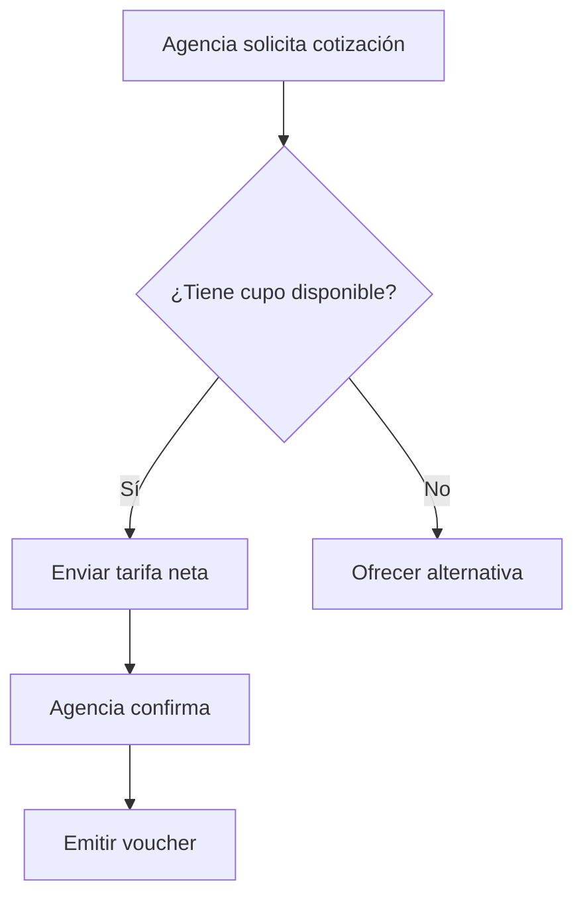
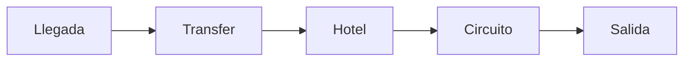
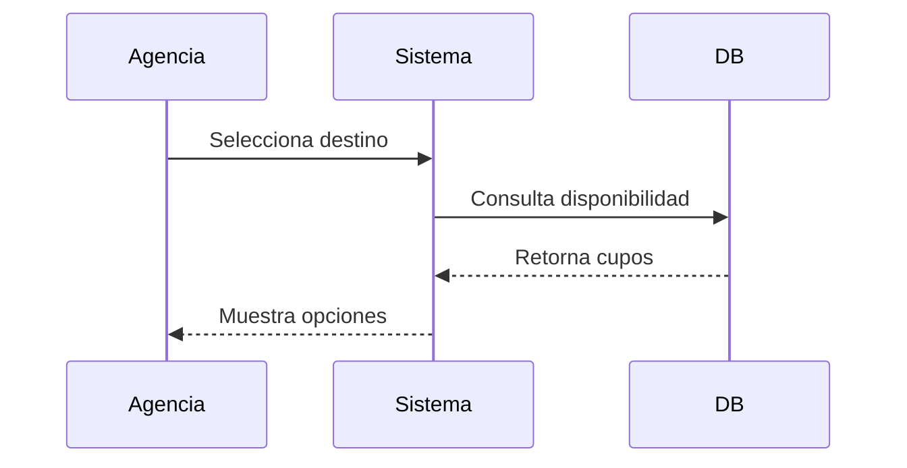

# KB_09 — Sales-Ready Markdown Formatting

## Executive Summary

"Sales-Ready Formatting" es la práctica de escribir documentación interna en Markdown con suficiente estructura, señalización visual y componentes reutilizables para que cualquier vendedor, PM o agencia pueda consumirla **sin fricción en PDF, Wiki o portal de docs**. No es estética: es velocidad de adopción.[^1]

Una doc mal formateada es una doc que no se lee. En contextos B2B mayorista —donde las agencias comparan proveedores en segundos— el **callout de ventaja diferencial** visible en 3 segundos puede valer más que cinco páginas de texto corrido.[^2]

El stack docs-as-code 2025–2026 converge en tres patrones: **Git-nativo + Markdown/MDX + render automático**. Las opciones principales son Docusaurus (open source, control total), Mintlify (developer-first, polished, costoso) y GitBook (equilibrio técnico/no-técnico).[^3]

Mermaid es el estándar de facto para diagramas inline en Markdown: nativo en GitHub, Docusaurus y GitBook, sin dependencias externas, versionado junto al código.[^4]

Los templates reutilizables (Feature Page, View Anatomy, Calculation Spec, Battlecard) son la unidad atómica de conocimiento vendedor: se generan una vez, se actualizan en CI/CD y se distribuyen a agencias como PDF o página web estática.[^5]

***

## Definitions and Why It Matters

**`[FACT]`** Sales-Ready Formatting = conjunto de convenciones Markdown + componentes visuales (alertas, callouts, tablas comparativas, diagramas Mermaid, secciones "next action") que permiten a una doc ser usada directamente en un contexto de venta, onboarding o soporte sin reescritura.[^1]

**`[INFERENCE]`** En un mayorista B2B como Alana Tours, donde las agencias reciben cotizaciones de múltiples mayoristas simultáneamente, la presentación del producto (Feature Page limpia, Battlecard rápido) es diferencial de conversión. La doc *es* el producto percibido antes del cierre.

**`[FACT]`** Docs-as-code es la práctica de tratar la documentación como código: vive en Git, pasa por Pull Requests, se despliega automáticamente. Reduce documentation drift y permite auditoría de cambios.[^3]

***

## Principles and Best Practices

### 1. Estructura Semántica: Headers como Navegación

Usa `##` para secciones principales, `###` para subsecciones. Cada header debe ser escaneable en 2 segundos. Docusaurus convierte automáticamente el árbol de headers en sidebar navegable.[^5]

**`[FACT]`** La documentación oficial de Docusaurus recomienda que cada página `.md` o `.mdx` tenga frontmatter con `id`, `title`, `sidebar_label` y `description` para SEO y navegación programática.[^6]

```markdown
---
id: feature-circuitos-europa
title: Circuitos Europa - Feature Page
sidebar_label: Circuitos Europa
description: Especificaciones técnicas y comerciales del portafolio Europa 2026
---
```


***

### 2. Alertas y Callouts (Admonitions)

**`[FACT]`** Docusaurus tiene soporte nativo de admonitions (callouts) con los tipos: `note`, `tip`, `info`, `warning`, `danger`. Se renderizan con color e ícono automáticamente.[^6]

```markdown
:::tip ✅ Ventaja diferencial
Incluye transfer privado en todos los circuitos Europa — competidores cobran extra.
:::

:::warning ⚠️ Sensible para agencias
Tarifa neta no publicable. Compartir solo con agencias acreditadas.
:::

:::danger 🚫 No incluye
Visa Schengen, seguro de viaje, excursiones opcionales.
:::
```

**`[INFERENCE]`** Para PDFs exportados (donde los admonitions no se renderizan), usa la convención de emojis + **bold** como fallback: `**⚠️ SENSIBLE:**`. Funciona en cualquier renderer.

***

### 3. Mermaid: Diagramas Inline

**`[FACT]`** GitHub renderiza Mermaid nativo desde 2022. Docusaurus lo soporta desde v2 con plugin incluido. GitBook tiene soporte nativo en 2025. Ningún SVG externo requerido.[^4]

**Cuándo usar cada tipo:**


| Tipo Mermaid | Caso de uso en turismo B2B |
| :-- | :-- |
| `flowchart TD` | Flujo de reserva / proceso de cotización |
| `sequenceDiagram` | Interacción agencia → mayorista → proveedor |
| `gantt` | Timeline de operación de un circuito |
| `pie` | Distribución de margen por componente |



**`[FACT]`** Best practice Mermaid: mantener diagramas simples, máximo 7–8 nodos por flujo. Diagramas complejos deben dividirse en partes más pequeñas.[^7]

***

### 4. Tablas Comparativas (Battlecard-Ready)

Las tablas en Markdown son el componente más usado en Battlecards. Regla: **máximo 4 columnas**, alineación consistente, sin celdas vacías.

```markdown
| Criterio | Alana Tours | Competidor A | Competidor B |
|---|---|---|---|
| Transfer privado | ✅ Incluido | ❌ Extra | ✅ Incluido |
| Guía en español | ✅ Siempre | ⚠️ Según destino | ❌ No disponible |
| Pago en BsD/COP | ✅ Sí | ❌ USD solo | ❌ USD solo |
| Tiempo de respuesta | < 2h | ~24h | ~6h |
```


***

### 5. Sección "Next Action"

**`[INFERENCE]`** Toda doc Sales-Ready debe terminar con una sección `## Next Action` con máximo 3 pasos concretos. Elimina la fricción de "¿qué hago con esto ahora?".

```markdown
## Next Action

1. **Compartir con la agencia**: Exportar como PDF o enviar link Wiki
2. **Confirmar disponibilidad**: Consultar sistema antes de cotizar
3. **Escalar objeción de precio**: Contactar a Víctor García (ext. 204)
```


***

## Templates Reutilizables

### Template A: Feature Page

```markdown
---
id: feature-[producto-slug]
title: [Nombre del Producto] — Feature Page
sidebar_label: [Nombre corto]
tags: [europa, circuito, aereo-incluido]
---

# [Nombre del Producto]

> **Una línea de venta:** [Propuesta de valor en < 20 palabras]

## ✅ Qué incluye
- Item 1
- Item 2

## ❌ Qué no incluye
- Item 1

## ⚠️ Qué es sensible
- Item 1 (ej. tarifa neta, vigencia, cupo)

## Diagrama de operación



## Objeciones frecuentes

| Objeción | Respuesta |
| :-- | :-- |
| "Está caro" | Incluye transfer privado + seguro básico que otros cobran aparte |

## Next Action

1. Solicitar cupo en sistema
2. Confirmar tarifa vigente
3. Enviar propuesta a agencia
```

***

### Template B: View Anatomy

```markdown
# [Vista/Módulo] — Anatomía

## Propósito
[Qué resuelve esta vista en 1–2 líneas]

## Componentes principales
| Componente | Función | ¿Editable? |
|---|---|---|
| Header | Navegación principal | No |
| Filtro de destino | Segmentar catálogo | Sí |

## Flujo de usuario



## Estados posibles

- `disponible` — cupo confirmado
- `bajo_cupo` — menos de 5 plazas
- `cerrado` — sin disponibilidad


## ⚠️ Notas operativas

:::warning
Si el estado es `bajo_cupo`, notificar al agente antes de cotizar.
:::

```

***

### Template C: Calculation Spec

```markdown
# [Nombre del Cálculo] — Especificación

## Fórmula
> `Precio Agencia = Tarifa Neta × (1 + Markup%) + Impuestos Locales`

## Variables
| Variable | Tipo | Fuente | Notas |
|---|---|---|---|
| Tarifa Neta | Float | Sistema tarifario | Sin IVA |
| Markup% | % | Configuración por canal | Default: 18% |
| Impuestos Locales | Float | País de destino | Variable |

## Casos borde
- Si `Markup% = 0` → alerta en sistema, requiere aprobación gerencial
- Si `Impuestos Locales = null` → usar 0, registrar en log

## Ejemplo
| Input | Valor |
|---|---|
| Tarifa Neta | USD 1,200 |
| Markup | 18% |
| Impuesto | USD 45 |
| **Precio Agencia** | **USD 1,461** |

## ⚠️ Sensible
:::danger
No compartir tarifa neta con el pasajero final. Solo precio al público.
:::
```


***

### Template D: Battlecard

```markdown
# Battlecard — [Competidor] vs Alana Tours

> **Uso:** Solo para equipos de ventas. No distribuir a agencias.

## Perfil del competidor
| Atributo | Detalle |
|---|---|
| Nombre | [Competidor] |
| Fortaleza principal | [1 línea] |
| Debilidad principal | [1 línea] |
| Precio relativo | ± X% vs Alana |

## Comparativa directa
| Criterio | Alana Tours | [Competidor] | Ventaja |
|---|---|---|---|
| Criterio 1 | ✅ | ❌ | Alana |
| Criterio 2 | ⚠️ | ✅ | Competidor |

## Cómo ganar
1. **Cuando pregunten por precio**: destacar inclusiones diferenciales
2. **Cuando mencionen soporte**: mostrar tiempo de respuesta < 2h
3. **Cuando comparen producto**: usar diagrama de circuito vs itinerario genérico

## Frases que funcionan
> "Incluimos transfer privado desde el primer día — revisa si [Competidor] lo cobra aparte."

## Next Action
- Si la agencia ya trabaja con [Competidor]: solicitar análisis comparativo a Víctor García
```


***

## Tooling Docs-as-Code: Pros / Cons (2025–2026)

| Tool | Precio | Open Source | Mermaid | Editor Visual | Mejor para |
| :-- | :-- | :-- | :-- | :-- | :-- |
| **Docusaurus** | Free (self-host) | ✅ MIT | ✅ Nativo | ❌ Solo Markdown | Equipos técnicos, control total [^3] |
| **Mintlify** | \$300/mes Pro | ❌ | ✅ | ⚠️ Básico | API-first startups, docs polished [^3] |
| **GitBook** | \$65/mes+ | ❌ | ✅ | ✅ WYSIWYG | Equipos mixtos técnico/comercial [^2] |
| **Notion** | \$8–20/u/mes | ❌ | ❌ | ✅ | Wikis internas, no docs públicos |
| **Obsidian** | Free / \$10/mes | Plugins | ✅ Plugin | ❌ | PKM individual, RAG local |

**`[FACT]`** Docusaurus tiene 61,800+ GitHub stars y es usado por React Native, Supabase y Figma. Es MIT license con zero licensing cost.[^3]

**`[FACT]`** GitBook auto-genera archivos `llms.txt` y `llms-full.txt` en cada publicación, facilitando ingesta por modelos de lenguaje como ChatGPT o Claude.[^2]

**`[INFERENCE]`** Para Alana Tours en mercados LATAM con fricción (Venezuela/Colombia), la opción pragmática es **GitBook** (no requiere DevOps, editor visual para el equipo comercial, Mermaid nativo) o **Docusaurus en Cloudflare Pages** (gratuito, rápido, SEO-optimizado) si hay un técnico que lo mantenga.

***

## Metrics / Success Signals

**`[FACT]`** Docusaurus y GitBook incluyen analytics de uso de páginas. Métricas clave a rastrear:[^3]

- **Time-on-page** > 90 seg en Feature Pages (señal de lectura real, no rebote)
- **Bounce rate** < 40% en Battlecards (señal de que el vendedor termina de leer)
- **PDF exports / mes** — proxy de uso activo en ventas
- **Docs desactualizadas** (sin commit > 60 días) = deuda técnica comercial
- **Objeciones no cubiertas** detectadas en calls de ventas → gap en templates

**`[INFERENCE]`** En contexto B2B mayorista, el mejor proxy de efectividad documental es la **reducción de preguntas repetitivas al equipo operativo**: si la agencia pregunta algo que está en la Feature Page, la doc falló.

***

## Operational Checklist

```markdown
### Antes de publicar cualquier doc Sales-Ready:
- [ ] Tiene frontmatter completo (id, title, tags, date)
- [ ] Sección ✅ Incluye / ❌ No incluye / ⚠️ Sensible separadas
- [ ] Al menos 1 callout con admonition o emoji-fallback
- [ ] Tabla comparativa si hay más de 2 opciones/competidores
- [ ] Diagrama Mermaid si hay un flujo de 3+ pasos
- [ ] Sección "Next Action" con máximo 3 pasos
- [ ] Probado en PDF export (sin broken images)
- [ ] Revisado por alguien de ventas (no solo técnico)
- [ ] Fecha de revisión próxima anotada en frontmatter
- [ ] Registrada en SOURCES.md o índice de docs
```


***

## Anti-Patterns

**`[FACT]`** Los anti-patterns más comunes en docs-as-code según la comunidad Docusaurus incluyen: over-versioning (mantener demasiadas versiones activas cuando solo se necesita una), y componentes Swizzled que requieren mantenimiento manual en cada upgrade.[^5]


| Anti-Pattern | Problema | Solución |
| :-- | :-- | :-- |
| "Muro de texto" sin headers | Nadie llega al bottom | Headers cada 3–5 párrafos |
| Tabla con 8+ columnas | Ilegible en mobile/PDF | Dividir en 2 tablas o usar lista |
| Mermaid con 15+ nodos | Se vuelve ilegible | Dividir en sub-diagramas [^7] |
| Doc sin fecha de revisión | Drift silencioso | Frontmatter con `last_reviewed` |
| Battlecard sin "cómo ganar" | Solo datos, sin táctica | Sección de frases y estrategia |
| Callouts para todo | Pierden jerarquía | Máximo 2–3 callouts por página |
| Precios hardcoded en docs | Desactualización inmediata | Link a sistema o tabla dinámica |


***

## Diagnostic Questions

1. ¿Puede un agente de ventas nuevo usar esta doc para responder una objeción en < 60 segundos?
2. ¿La sección "No incluye" está tan visible como la sección "Incluye"?
3. ¿Cuándo fue el último commit a esta página? ¿Es > 60 días? → posible drift
4. ¿El diagrama Mermaid se renderiza correctamente en el tool elegido?
5. ¿La doc exporta a PDF sin broken components?
6. ¿El equipo comercial (no técnico) puede editarla sin ayuda de un dev?
7. ¿Existe un Battlecard activo para cada competidor principal en el portafolio?
8. ¿Las secciones sensibles (tarifas netas, márgenes) están separadas de las compartibles?

***

## Sources

| \# | Fuente | URL | Fecha |
| :-- | :-- | :-- | :-- |
| S1 | Docusaurus Official Docs | https://docusaurus.io/docs | 2024 |
| S2 | GitHub Mermaid Integration | https://github.blog/developer-skills/github/include-diagrams-markdown-files-mermaid/ | 2024 |
| S3 | Ferndesk API Docs Comparison 2026 | https://ferndesk.com/blog/best-api-documentation-tools | 2025-12 |
| S4 | GitBook vs Mintlify 2026 | https://www.gitbook.com/blog/gitbook-vs-mintlify | 2026-02 |
| S5 | Best Dev Doc Tools 2025 (Infrasity) | https://dev.to/infrasity-learning/best-developer-documentation-tools-in-2025 | 2025-12 |
| S6 | Mermaid Best Practices (Miro) | https://miro.com/diagramming/what-is-mermaid/ | 2024 |
| S7 | OpenReplay Docusaurus Guide | https://blog.openreplay.com/building-doc-sites-docusaurus/ | 2024-03 |
| S8 | Guidejar Docs Tools 2026 | https://www.guidejar.com/blog/top-software-documentation-tools-for-2026 | 2025-10 |


***

## Key Takeaways for PM Practice

- **La doc es el producto percibido** antes del cierre: Feature Pages limpias = menor fricción de venta[^1]
- **Separar siempre** ✅ Incluye / ❌ No incluye / ⚠️ Sensible — es la estructura mínima viable de cualquier doc comercial
- **Mermaid es el estándar 2025–2026** para diagramas inline: nativo en GitHub, Docusaurus y GitBook, versionado en Git[^4]
- **GitBook** es la opción pragmática para equipos mixtos técnico-comercial en LATAM; **Docusaurus** para equipos con capacidad técnica y zero budget de licencias[^2][^3]
- **Battlecards sin "cómo ganar"** son solo datos — agregar siempre frases de venta y tácticas de objeción
- **Anti-pattern más costoso**: precios hardcoded en docs — generan deuda comercial inmediata
- **Next Action** al final de cada doc elimina la fricción de "¿y ahora qué?" — aumenta tasa de uso real
- **Mermaid con > 8 nodos** pierde efectividad — dividir en sub-diagramas contextuales[^7]
- Los templates reutilizables (A–D) son la unidad atómica: se generan una vez, se mantienen en CI/CD, se distribuyen como PDF o Wiki estático
- **Métricas de adopción documental** (time-on-page, PDF exports, objeciones no cubiertas) deben medirse igual que métricas de producto
<span style="display:none">[^10][^11][^12][^13][^14][^15][^16][^8][^9]</span>

<div align="center">⁂</div>

[^1]: https://dev.to/infrasity-learning/best-developer-documentation-tools-in-2025-mintlify-gitbook-readme-docusaurus-10fc

[^2]: https://www.gitbook.com/blog/gitbook-vs-mintlify

[^3]: https://ferndesk.com/blog/best-api-documentation-tools

[^4]: https://github.blog/developer-skills/github/include-diagrams-markdown-files-mermaid/

[^5]: https://blog.openreplay.com/building-doc-sites-docusaurus/

[^6]: https://docusaurus.io/docs

[^7]: https://miro.com/diagramming/what-is-mermaid/

[^8]: pasted-text.txt

[^9]: https://github.com/facebook/docusaurus/discussions/11171

[^10]: https://docusaurus.io/community/resources

[^11]: https://discuss.ocaml.org/t/2025-documentation-best-practices/17008?page=2

[^12]: https://nikhilajain.com/blog/posts/create-your-first-docusaurus-documentation-website/

[^13]: https://www.mintlify.com/blog/best-api-documentation-tools-of-2025

[^14]: https://jimmywongiot.com/2025/08/28/how-to-use-mermaid-in-visual-studio-code-a-step-by-step-guide-for-developers/

[^15]: https://docusaurus.io/docs/styling-layout

[^16]: https://www.guidejar.com/blog/top-software-documentation-tools-for-2026

