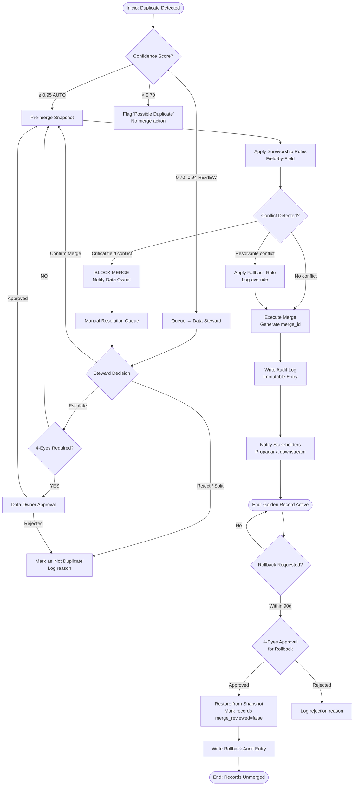

# KB_14_Dedup_Survivorship_Merge_Policies.md

Prompt:
“Crea una guía (2025–2026) para definir survivorship rules y políticas de merge en CRM: precedencia por campo, conflicto entre fuentes, auditoría del merge, rollback/unmerge, approvals (4-eyes), límites de batch, y permisos.
Incluye:
Plantilla ‘Survivorship Policy’ (por entidad y por campo)
Diagrama de flujo (Mermaid) del proceso merge→audit→rollback
Casos borde (campos nulos, timestamps inconsistentes, data stale)
Checklist operativo + anti-patterns
Citas por sección. Facts vs Inferences.”

---

# KB_14 — Dedup, Survivorship \& Merge Policies en CRM Enterprise (2025–2026)


***

## Executive Summary

Las políticas de deduplicación, survivorship y merge son la columna vertebral de la calidad del dato en CRM enterprise. Sin reglas explícitas, el merge produce "golden records" contaminados: datos más recientes sobreescriben datos correctos, fuentes no confiables ganan, y la trazabilidad se pierde.[^1]

El concepto central es el **golden record**: el registro maestro superviviente que resulta de fusionar duplicados bajo un conjunto de reglas declaradas. Las reglas de survivorship determinan, campo por campo, qué valor prevalece en función de fuente, completitud, recencia y lógica de negocio.  Sin estas reglas, los equipos "dejan que la herramienta decida" — lo que en la práctica significa pérdida silenciosa de datos críticos.[^2][^1]

El proceso completo tiene tres fases no negociables: **before** (prevención en el punto de entrada), **during** (detección con umbrales y matching multi-campo), y **after** (survivorship explícita + auditoría + mantenimiento recurrente).  La gobernanza del merge requiere control de acceso basado en roles (RBAC), aprobación 4-eyes para merges de alto impacto, límites de batch para prevenir cambios masivos no supervisados, y capacidad de rollback/unmerge documentada.[^3][^4][^1]

**[FACT]** Oracle Enterprise Data Management implementa 4-eyes por defecto: el submitter no puede ser aprobador en el mismo workflow.  **[FACT]** McKinsey (2024) identifica MDM como palanca directa para acceso ordenado a datos de clientes y proveedores, con retorno mensurable en eficiencia operativa.  **[INFERENCE]** En entornos LATAM con alta rotación de agentes y múltiples fuentes de ingesta (formularios, WhatsApp, ERPs locales), la ausencia de survivorship explícita es el principal vector de degradación del CRM B2B.[^4][^5]

La deuda técnica de no tener estas políticas se manifiesta como: reportes contradictorios entre equipos, ventas duplicadas a la misma cuenta, compliance imposible bajo GDPR/LGPD, y merges irreversibles que obligan a restaurar backups completos.[^6][^3]

Este documento define la arquitectura de decisión completa: plantillas por entidad/campo, flujo de aprobación, auditoría, rollback, casos borde, y checklist operativo.

***

## Definitions and Why It Matters

**[FACT]** Las definiciones técnicas son estables en la industria MDM desde 2020 y confirmadas en literatura 2025–2026.[^7][^2]


| Término | Definición operativa | Por qué importa en CRM B2B |
| :-- | :-- | :-- |
| **Duplicate** | Dos o más registros que representan la misma entidad real del mundo | Genera doble contacto, doble oferta, datos segmentados incorrectamente |
| **Golden Record** | Registro maestro superviviente resultante del merge con atributos de mayor confianza | Single source of truth para downstream (ERP, email, analytics) |
| **Survivorship Rule** | Lógica que determina qué valor de campo prevalece en el merge | Sin ella, el merge es arbitrario o dependiente del sistema origen |
| **Merge Policy** | Conjunto de reglas que gobiernan el proceso completo: matching → decisión → ejecución → auditoría | Define quién puede hacer qué, cuándo, con qué límites |
| **Master Record** | El registro designado como "ganador" en una operación de merge específica; puede ser distinto al golden record final | Es el contenedor; survivorship llena sus campos |
| **Unmerge / Rollback** | Reversión de una operación de merge, restaurando los registros separados al estado previo | Crítico para errores de matching; pocos CRMs lo soportan nativamente [^8] |
| **4-Eyes Principle** | Control que requiere que al menos dos personas distintas aprueben una acción antes de ejecutarse [^9] | Previene fraude, errores masivos y merges no autorizados |
| **Data Steward** | Responsable humano de resolver conflictos de baja confianza, excepciones y correcciones [^7] | El humano en el loop para merges ambiguos |
| **Stale Data** | Dato que fue correcto en el pasado pero no refleja la realidad actual (ej.: email laboral de empleado que cambió de empresa) | Puede "ganar" incorrectamente si la regla es solo "más completo" |
| **Confidence Score** | Métrica numérica que indica qué tan probable es que dos registros sean duplicados | Umbral de corte define merge automático vs. revisión manual [^10] |

**[INFERENCE]** En mayoristas de turismo B2B (ej.: Alana Tours), las entidades críticas son `Agency` (agencia cliente), `Contact` (ejecutivo de cuenta), y `Booking` (reserva). Un merge incorrecto entre dos agencias con nombres similares pero RIF/NIT distintos es irreversible sin un proceso de unmerge documentado.

***

## Principles and Best Practices

### 1. Jerarquía de Fuentes (Source Priority)

**[FACT]** La precedencia por fuente es el patrón más robusto: se define un ranking explícito de sistemas y la regla es "gana el valor del sistema de mayor jerarquía que tenga el campo poblado".[^11][^1]

Ejemplo de jerarquía típica en CRM enterprise:

```
1. CRM (entrada manual validada por agente senior)
2. ERP / sistema de facturación
3. Marketing Automation (HubSpot, Marketo)
4. Data enrichment providers (Dun & Bradstreet, Clearbit)
5. Importaciones CSV / formularios web
6. Integraciones de terceros no validadas
```

**[FACT]** Profisee (2025) documenta que los data stewards revisan registros potencialmente duplicados y seleccionan "winners"; luego el merge aplica survivorship rules predefinidas que determinan qué valores retener ante conflictos.[^12]

### 2. Reglas de Survivorship por Tipo de Campo

**[FACT]** CleanSmart Labs (2026) identifica cuatro estrategias fundamentales, no mutuamente excluyentes.[^1]


| Estrategia | Cuándo aplicar | Riesgo |
| :-- | :-- | :-- |
| **Most complete wins** | Campos de contacto básico (teléfono, dirección) | Puede preservar dato antiguo si está "lleno" |
| **Most recent wins** | Campos que cambian (cargo, empresa, email) | Requiere timestamps confiables — ver §Edge Cases |
| **Source priority** | Cualquier campo con jerarquía de fuente definida | Fuente top puede tener dato incorrecto si no hay validación de entrada |
| **Field-by-field selection** | Cuentas enterprise de alto valor | Labor-intensivo; reservar para top accounts |

**[INFERENCE]** La combinación óptima para CRM B2B con baja madurez de datos es: Source Priority como regla base + Most Complete como fallback + Field-by-Field manual para cuentas estratégicas.

### 3. Matching: Determinístico + Fuzzy

**[FACT]** numerous.ai (2026) recomienda combinar reglas determinísticas (mismo email = duplicado) con fuzzy matching (nombres similares, direcciones) y siempre mantener un golden record accesible.[^7]

- **Determinístico:** email exacto, tax ID (RIF/NIT/CUIT), número de cuenta — confianza ≥ 0.95 → merge automático
- **Fuzzy:** nombre + ciudad + teléfono similar — confianza 0.70–0.94 → cola de revisión humana
- **< 0.70:** no merge; loguear como "possible duplicate" para revisión periódica[^10]

**[FACT]** MatchDataPro (2025) documenta que la validación por IA marca matches de baja confianza para revisión humana en lugar de confiar ciegamente en merges automatizados.[^10]

### 4. Auditoría del Merge

**[FACT]** Airbyte (2026) establece que las organizaciones deben implementar audit logging comprensivo y role-based access controls como consideraciones de seguridad críticas.[^3]

Cada operación de merge debe registrar en log inmutable:

- `merge_id` (UUID)
- `timestamp_utc`
- `initiator_user_id` + `approver_user_id` (si aplica 4-eyes)
- `source_record_ids[]` (todos los registros fusionados)
- `surviving_record_id`
- `field_level_decisions[]`: para cada campo → `{field_name, source_record_id_winner, rule_applied, previous_values_snapshot}`
- `confidence_score`
- `merge_type`: AUTO | MANUAL | BATCH
- `rollback_available`: true/false + `snapshot_id`


### 5. Rollback / Unmerge

**[FACT]** Microsoft Dynamics 365 CRM no soporta unmerge nativo; soluciones de terceros como "Snapshot" permiten restaurar desde el audit log.  **[INFERENCE]** Esto hace que el pre-merge snapshot sea obligatorio en cualquier CRM enterprise donde rollback sea un requerimiento de negocio.[^8]

Protocolo de rollback:

1. Snapshot pre-merge almacenado en tabla separada (no sobreescribible)
2. Ventana de rollback configurable: recomendado 90 días para cuentas B2B
3. Rollback requiere el mismo nivel de aprobación que el merge original
4. Post-rollback: marcar ambos registros como "merge_reviewed = false" para re-evaluación

### 6. Aprobación 4-Eyes

**[FACT]** Oracle Enterprise Data Management implementa el principio 4-eyes por defecto: los workflows excluyen al submitter como aprobador salvo configuración explícita contraria.  **[FACT]** Four-Eyes Approval para Dynamics 365 Business Central bloquea la cuenta hasta que un supervisor con mandato apruebe el cambio, manteniendo log completo de cambios y aprobaciones.[^13][^4]

Matriz de aprobación para merges:


| Tipo de merge | Umbral | Flujo aprobación |
| :-- | :-- | :-- |
| Auto-merge (confianza ≥ 0.95, registros < 50) | Batch diario | Log automático, sin aprobación humana |
| Semi-automático (confianza 0.70–0.94) | Por registro | 1 data steward aprueba |
| Manual / alto impacto (cuentas enterprise, >100 registros afectados) | Por lote | 4-eyes: data steward + data owner |
| Merge entre entidades distintas (ej.: merge de Contact a Account) | Siempre | 4-eyes + notificación a CRM Admin |

### 7. Límites de Batch

**[INFERENCE]** No existe un estándar universal publicado para batch limits de merge; los valores siguientes son las mejores prácticas inferidas de literatura MDM y limitaciones conocidas de APIs (Salesforce Bulk API, Dynamics). Documentar como `INFERENCE`.

- **Batch auto-merge:** máximo 500 registros/ejecución (recomendado); ejecutar en ventana fuera de horario laboral
- **Revisión humana pendiente:** máximo 200 registros en cola por steward activo
- **Merges manuales por usuario/día:** máximo 50 sin aprobación adicional; >50 requiere justificación escrita
- **Emergency freeze:** si una ejecución de batch supera el 2% del total de registros de una entidad, pausar y escalar a CRM Admin


### 8. Permisos RBAC

**[FACT]** Microsoft (2025) documenta best practices RBAC: aplicar mínimo privilegio, segregar duties, y limitar roles y scopes para reducir superficie de riesgo.[^14]


| Rol | Puede detectar duplicados | Puede proponer merge | Puede aprobar merge | Puede ejecutar merge | Puede hacer rollback |
| :-- | :-- | :-- | :-- | :-- | :-- |
| **CRM User** | ✅ | ✅ (propio territorio) | ❌ | ❌ | ❌ |
| **Data Steward** | ✅ | ✅ | ✅ (confianza < 0.95) | ✅ (hasta 50/día) | ❌ |
| **Data Owner / Manager** | ✅ | ✅ | ✅ (todos) | ✅ | ✅ (con log) |
| **CRM Admin** | ✅ | ✅ | ✅ | ✅ (batch) | ✅ (emergencia) |
| **Auditor** | ✅ (read-only) | ❌ | ❌ | ❌ | ❌ |


***

## Survivorship Policy Template

### Template: Por Entidad y Por Campo

```markdown
## SURVIVORSHIP POLICY — [ENTITY_NAME]
Version: 1.x | Owner: [Data Owner] | Review cycle: Quarterly

### Entity Metadata
- Entity: [Contact / Account / Lead / Opportunity]
- Primary keys considered for match: [email, tax_id, phone_normalized]
- Confidence threshold AUTO-MERGE: [0.95]
- Confidence threshold MANUAL REVIEW: [0.70–0.94]
- Batch limit: [500 records/run]
- 4-Eyes required: [YES — for accounts with revenue > $X or tier = Enterprise]

### Field-Level Rules

| Field Name       | Rule                  | Source Priority          | Fallback          | Null Handling              | Notes                          |
|------------------|-----------------------|--------------------------|-------------------|----------------------------|--------------------------------|
| email_primary    | Source Priority       | CRM > ERP > MAP > CSV    | Most Recent       | Si ambos null → flag manual| Validar MX record post-merge   |
| phone_mobile     | Most Complete         | —                        | Source Priority   | Mantener cualquier valor   |                                |
| company_name     | Source Priority       | ERP > CRM > Enrichment   | Most Recent       | No merge si ambos distintos y no-null → manual | |
| tax_id (RIF/NIT) | Deterministic Lock    | —                        | No fallback       | Si null → flag crítico     | NUNCA sobreescribir si ≠ NULL  |
| address_full     | Most Recent           | —                        | Most Complete     | Si stale > 180d → flag     | Validar con Google Maps API    |
| job_title        | Most Recent           | —                        | Source Priority   | Mantener si < 365d         |                                |
| created_date     | Keep Oldest           | —                        | —                 | Usar MIN(created_date)     | Preserva historia              |
| owner_user_id    | Manual Only           | —                        | —                 | Requiere 4-eyes            | No auto-reassign               |
| revenue_annual   | Source Priority       | ERP > Enrichment > CRM   | Most Recent       | Si discrepancia > 20% → flag | |
| tags/segments    | Union (merge all)     | —                        | —                 | Concatenar unique values   |                                |
| notes/activity   | Concatenate + timestamp | —                      | —                 | Nunca descartar            | Prefixar con "[Merged from ID]"|

### Conflict Resolution Matrix
- Mismo campo, mismo valor: AUTO → keep value
- Mismo campo, valores distintos, regla aplicable: AUTO → apply rule
- Mismo campo, valores distintos, regla no aplicable o empate: → QUEUE MANUAL
- Campo crítico (tax_id, owner_id) en conflicto: → BLOCK MERGE + notify Data Owner
```


***

## Diagrama de Flujo: Merge → Audit → Rollback




***

## Examples — Aplicado a CRM Enterprise

### Caso 1: Merge de Cuentas B2B (Agencias de Viaje)

**Escenario:** Dos registros de "Viajes Libertad C.A." en el CRM — uno creado por el equipo de ventas (Venezuela), otro importado desde el sistema de reservas (Colombia). Campos en conflicto: `phone_primary`, `email_contact`, `tax_id`.

**[FACT]** DataTrim documenta que en Salesforce, cuando el Master Record tiene campo vacío y el duplicado tiene el campo poblado, el valor del duplicado se transfiere (enriquecimiento). Cuando el Master tiene campo poblado, su valor permanece y el valor del duplicado se pierde.[^15]

Aplicación de política:

```
tax_id: RIF J-30123456-7 (CRM) vs. NIT 900.123.456-1 (Reservas)
→ BLOCK MERGE: son entidades legales distintas (Venezuela vs. Colombia)
→ Acción: crear relación "parent/subsidiary" en lugar de merge

email_contact: ventas@libertad.com.ve (CRM, source_rank=1) vs. 
               reservas@libertad.com (Reservas, source_rank=2)
→ Source Priority → CRM gana → email de reservas va a field "email_secondary"

phone_primary: NULL (CRM) vs. +58 412-555-0000 (Reservas)
→ Most Complete → teléfono de Reservas sobrevive
```


### Caso 2: Merge Masivo Post-Migración

**Escenario:** Importación de 15,000 leads desde spreadsheet legacy. Herramienta detecta 1,200 posibles duplicados contra CRM existente.

**[FACT]** cleansmartlabs.com (2026) recomienda que antes del merge masivo se defina survivorship explícita; sin ella, "la herramienta elige" produciendo peor calidad que el estado inicial.[^1]

Protocolo aplicado:

1. Confianza ≥ 0.95: 340 pares → batch auto-merge, ventana nocturna, 500 max/run
2. Confianza 0.70–0.94: 620 pares → cola de steward (máximo 200/día)
3. Confianza < 0.70: 240 pares → tagged "possible_duplicate", revisión mensual
4. Post-merge: validación de 10% muestra aleatoria por Data Owner

***

## Edge Cases (Casos Borde)

**[FACT]** Los edge cases son la principal causa de errores silenciosos post-merge; deben estar explícitamente documentados en la política.[^3][^1]

### EC-01: Campos Nulos en Ambos Registros

```
Ambos registros tienen phone_mobile = NULL
→ Regla "Most Complete" no aplica (empate en vacío)
→ Acción: campo queda NULL en golden record + flag "enrichment_needed"
→ NO bloquear el merge por este motivo (salvo que sea campo requerido/crítico)
```


### EC-02: Timestamps Inconsistentes (Stale Data)

**[INFERENCE]** La regla "Most Recent wins" falla silenciosamente cuando los sistemas de origen tienen relojes no sincronizados, zonas horarias distintas, o fechas de creación que no reflejan la última actualización real del dato.

Protocolo defensivo:

- Si `last_modified_delta` entre registros < 48h → No aplicar "Most Recent"; escalar a manual
- Si el campo no tiene `last_modified` timestamp → Asumir que la fuente de mayor jerarquía gana (Source Priority fallback)
- Si timestamp futuro detectado (> fecha actual) → Flag como datos corruptos; no participar en merge


### EC-03: Dato "Stale" en Fuente de Alta Jerarquía

```
CRM (rank=1): job_title = "Gerente General" — last_modified = hace 3 años
MAP (rank=3): job_title = "Director Comercial" — last_modified = hace 2 semanas

Regla pura Source Priority: CRM gana → preserva dato incorrecto
Regla correcta: Source Priority con decay rule:
  IF source_rank_winner.last_modified > (NOW - staleness_threshold) → Source Priority aplica
  ELSE → Most Recent gana (con log de override)
  
Staleness_threshold recomendado por tipo de campo:
  - job_title: 365 días
  - email_primary: 180 días
  - address_full: 180 días
  - company_name: 730 días
  - tax_id: NUNCA stale (dato permanente)
```


### EC-04: Conflicto N>2 Registros (Cluster de Duplicados)

```
5 registros del mismo contact detectados con confianza cruzada variable
→ Construir cluster → identificar Master Record (el más completo + fuente más alta)
→ Aplicar merges en cascada: Master ← Record2, luego Master ← Record3, etc.
→ Cada merge individual genera su propio audit entry con merge_cluster_id compartido
→ Rollback de cluster debe ser atómico (revertir todos o ninguno)
```


### EC-05: Merge de Registro con Transacciones Asociadas

```
Account A tiene 12 Opportunities abiertas
Account B tiene 8 Opportunities abiertas
→ Merge de cuentas: surviving Account hereda TODAS las Opportunities (20)
→ Verificar: no duplicar Opportunity si ambas cuentas tenían la misma deal
→ Aplicar dedup de Opportunities post-merge como proceso separado
→ Notificar a los owners de cada Opportunity del cambio de Account parent
```


***

## Metrics / Success Signals

**[FACT]** Airbyte (2026) recomienda auditorías formales trimestrales con monitoreo automatizado diario para entornos de alto volumen, con KPIs alineados a objetivos de negocio.[^3]


| Métrica | Definición | Target | Frecuencia |
| :-- | :-- | :-- | :-- |
| **Duplicate Rate** | % registros duplicados / total registros por entidad | < 2% Contact; < 1% Account | Mensual |
| **Auto-merge Precision** | % merges automáticos correctos (validado por muestreo) | ≥ 97% | Por batch |
| **Manual Review Queue Age** | Tiempo promedio en cola antes de resolución | < 5 días hábiles | Semanal |
| **Rollback Rate** | % merges revertidos / total merges ejecutados | < 0.5% | Mensual |
| **Stale Field Rate** | % campos con staleness_threshold superado | < 5% por entidad | Mensual |
| **4-Eyes Compliance** | % merges de alto impacto con aprobación dual documentada | 100% | Por evento |
| **Audit Log Completeness** | % merges con audit entry completo (todos los campos requeridos) | 100% | Continuo/automático |
| **Golden Record Coverage** | % registros que tienen golden record designado vs. total | ≥ 95% cuentas activas | Mensual |


***

## Operational Checklist

### Pre-Merge

- [ ] Snapshot de todos los registros involucrados creado y verificado
- [ ] Política de survivorship vigente para la entidad en cuestión (versión documentada)
- [ ] Confianza de matching calculada y dentro del umbral correcto
- [ ] Verificación de campos críticos (tax_id, owner_id) — no conflicto o conflicto explícitamente escalado
- [ ] Si batch: tamaño ≤ límite configurado; ventana horaria fuera de peak
- [ ] Si 4-eyes requerido: aprobación de segundo revisor obtenida y logueada


### Durante el Merge

- [ ] Survivorship rules aplicadas campo por campo (no global overwrite)
- [ ] Conflictos no resolubles → merge bloqueado o campo marcado como "conflict_pending"
- [ ] Audit log escrito atómicamente con el merge (no post-hoc)
- [ ] Relaciones/asociaciones (Opportunities, Activities, Notes) verificadas como transferidas


### Post-Merge

- [ ] Notificación enviada a record owners afectados
- [ ] Downstream systems notificados (ERP, MAP, analytics) vía CDC o evento
- [ ] Muestreo de calidad: revisar 10% de merges del batch
- [ ] Métricas actualizadas (duplicate rate, queue age)
- [ ] Rollback window abierta y snapshot verificado como accesible


### Mantenimiento Recurrente

- [ ] Auditoría mensual de reglas de survivorship (¿siguen siendo válidas con el negocio actual?)
- [ ] Revisión trimestral de umbrales de confianza
- [ ] Revisión anual de jerarquía de fuentes (¿cambió algún sistema de origen?)
- [ ] Training anual a data stewards sobre edge cases y casos borde nuevos

***

## Anti-Patterns

**[FACT]** WinPure (2025) identifica la falta de reglas explícitas de survivorship y la ausencia de auditorías regulares como las dos principales fallas en programas de deduplicación CRM.[^16]

### AP-01: "Winner takes all" sin reglas por campo

**Qué pasa:** Se designa un Master Record y todos sus campos sobreescriben al duplicado, incluso cuando el duplicado tiene datos más recientes o de mejor calidad.
**Impacto:** Pérdida silenciosa de datos; ningún error visible, pero golden record incorrecto.
**Corrección:** Field-level survivorship rules obligatorias.

### AP-02: Merge automático de tax_id en conflicto

**Qué pasa:** La herramienta aplica "Most Recent" o "Source Priority" a campos de identidad legal.
**Impacto:** Dos entidades legales distintas fusionadas en un solo registro; caos en facturación y compliance.
**Corrección:** tax_id como campo "deterministic lock" — cualquier conflicto bloquea el merge.

### AP-03: Sin snapshot pre-merge

**Qué pasa:** Se ejecuta el merge sin guardar estado previo.
**Impacto:** Rollback imposible; restauración requiere backup completo de base de datos.
**Corrección:** Snapshot atómico obligatorio antes de cualquier merge.

### AP-04: Batch sin límite en horario productivo

**Qué pasa:** Job de deduplicación masiva corre en horario pico, bloqueando tabla de Accounts.
**Impacto:** Degradación de performance, merges incompletos, inconsistencias de concurrencia.
**Corrección:** Batch limits + ventana nocturna + circuit breaker si se supera % del total.

### AP-05: 4-Eyes eludido por "urgencia"

**Qué pasa:** Data Admin ejecuta merge de alto impacto sin segundo aprobador "porque era evidente".
**Impacto:** Violación de política; no detectable hasta auditoría; crea precedente de bypass.
**Corrección:** Bloqueo técnico (no solo de proceso); el sistema no debe permitir la ejecución sin segundo aprobador en casos marcados.

### AP-06: Timestamps de distintos sistemas comparados directamente

**Qué pasa:** Sistema A en UTC-4, Sistema B en UTC+0; "Most Recent" compara strings sin normalizar.
**Impacto:** El registro "más antiguo" gana porque su timestamp aparece como mayor.
**Corrección:** Normalizar a UTC antes de cualquier comparación de recencia.

### AP-07: Notas y Activities descartadas en el merge

**Qué pasa:** Se conservan campos de contacto pero se pierden las actividades del registro duplicado.
**Impacto:** Historial de interacción con el cliente incompleto; vendedor no ve llamadas anteriores.
**Corrección:** Notes y Activities son siempre `union/concatenate` — nunca se descartan.

### AP-08: Survivorship rules sin ownership ni versioning

**Qué pasa:** Las reglas existen en la cabeza del Admin o en un doc sin fecha.
**Impacto:** Reglas obsoletas aplicadas; nadie sabe qué versión está activa; cambios sin aprobación.
**Corrección:** Política versionada en repositorio (ej.: este KB), con owner nombrado y review cycle.

***

## Diagnostic Questions

Preguntas para evaluar la madurez del programa de dedup/survivorship de tu CRM:

1. **¿Tienes una política de survivorship documentada por entidad?** Si no: ningún merge debería correr en producción.
2. **¿Cuántos merges ejecutaste el último mes? ¿Cuántos fueron automáticos?** Si no lo sabes: no tienes audit log funcional.
3. **¿Puedes revertir el último merge de alto impacto en < 30 minutos?** Si no: no tienes rollback operativo.
4. **¿Quién fue el segundo aprobador del último merge de cuenta enterprise?** Si no hay respuesta: 4-eyes no está funcionando.
5. **¿Cuál es el duplicate rate actual de tu entidad Account?** Si es > 5%: hay un problema de prevención en el punto de entrada.
6. **¿Tu regla "Most Recent" normaliza timestamps a UTC?** Si no: tienes un bug silencioso en producción.
7. **¿Las notas y actividades se preservan en todos los merges?** Prueba: merge dos records de prueba y verifica el historial de actividad del golden record.
8. **¿Cuánto tiempo tarda un registro en la cola de revisión manual antes de ser resuelto?** Si > 10 días: el programa de stewardship está sub-dimensionado.
9. **¿Las downstream systems (ERP, analytics) reciben notificación de merges ejecutados?** Si no: los datos divergen silenciosamente entre sistemas.
10. **¿Cuándo fue la última vez que revisaste los umbrales de confianza de matching?** Si > 6 meses y el negocio cambió: los umbrales pueden estar desactualizados.

***

## Key Takeaways for PM Practice

- **Survivorship sin field-level granularity no es survivorship:** una regla global destruye datos. La política debe ser por campo, por entidad, versionada.[^1]
- **El merge es una operación de escritura destructiva** — tratar como deploy en producción: snapshot, approval, rollback plan.[^6]
- **4-eyes no es burocracia; es el único control que detiene errores masivos** antes de que se propaguen a downstream.[^4]
- **tax_id / identificadores legales son campos "sacred":** ninguna regla automática debe resolverlos en caso de conflicto; siempre bloquear y escalar. [INFERENCE - basado en mejores prácticas MDM]
- **Stale data + Source Priority = trampa:** la fuente de mayor jerarquía puede tener el dato más antiguo. Implementar staleness thresholds por tipo de campo.[^1]
- **Los timestamps requieren normalización a UTC** antes de cualquier lógica de "most recent"; es el bug más común y más silencioso. [INFERENCE]
- **Notes y Activities son historial de negocio, no metadata:** siempre union/concatenate, nunca descartar en merge.[^6]
- **Batch limits protegen la base de datos Y al negocio:** un merge masivo incorrecto sin límites puede comprometer miles de registros antes de ser detectado. [INFERENCE]
- **Rollback debe ser testeable en staging antes de que lo necesites en producción:** si nunca lo probaste, no existe cuando importa.[^7]
- **Auditoría mensual de reglas es tan importante como la ejecución:** las reglas correctas hoy pueden ser incorrectas en 6 meses si el negocio cambió.[^3]

***

## Sources

```markdown
## SOURCES.md — KB_14_Dedup_Survivorship_Merge_Policies

| ID | Source | URL | Date | Type |
|----|--------|-----|------|------|
| S1 | CleanSmart Labs — Data Deduplication Strategy | https://www.cleansmartlabs.com/blog/data-deduplication-strategy-before-during-and-after-the-merge | 2026-02-09 | Blog/Best Practice |
| S2 | Profisee — MDM Survivorship | https://profisee.com/blog/mdm-survivorship/ | 2025-12-23 | Vendor/MDM |
| S3 | Airbyte — CRM Data Consistency | https://airbyte.com/data-engineering-resources/maintain-data-consistency-when-merging-crm-records | 2026-01-29 | Engineering Guide |
| S4 | numerous.ai — Customer MDM Best Practices | https://numerous.ai/blog/customer-master-data-management-best-practices | 2026-01-26 | Best Practice |
| S5 | Oracle EDM — Governance Workflows | https://docs.oracle.com/en/cloud/saas/enterprise-data-management-cloud/dmcaa/request_workflows_100xf7ddafd7.html | 2025-10-01 | Official Docs |
| S6 | WinPure — CRM Dedup | https://winpure.com/how-to-dedupe-crm/ | 2025-07-17 | Best Practice |
| S7 | Dedupely — Merge CRM Records | https://dedupe.ly/blog/merge-crm-records-without-losing-data | 2026-02-11 | Tool/Best Practice |
| S8 | DataTrim — Salesforce Survivorship | https://www.datatrim.com/merging-records-survivorship-considerations/ | 2021-07-07 | Salesforce Specific |
| S9 | InTandem — CRM Audit Playbook | https://growintandem.com/crm-audit-playbook/ | 2025-08-08 | Playbook |
| S10 | Microsoft — RBAC Best Practices | https://learn.microsoft.com/en-us/azure/role-based-access-control/best-practices | 2025-03-29 | Official Docs |
| S11 | Four-Eyes Approval — BC Marketplace | https://marketplace.microsoft.com/en-us/product/dynamics-365-business-central/pubid.profactoas1585665701232 | 2025-12-08 | Product Docs |
| S12 | MatchDataPro — CRM Migration 2025 | https://matchdatapro.com/crm-migration-how-to-prepare-your-data-for-seamless-transition/ | 2025-09-25 | Guide |
| S13 | McKinsey — Master Data Management | https://www.mckinsey.com/capabilities/tech-and-ai/our-insights/master-data-management-the-key-to-getting-more-from-your-data | 2024-05-14 | Research |
| S14 | Microsoft Dynamics Community — Unmerge | https://community.dynamics.com/forums/thread/details/?threadid=4051d2f0-4bb4-4d87-83db-38c83b78a249 | 2018-12-31 | Community/Forum |
| S15 | Profisee — Data Matching Guide | https://profisee.com/blog/data-matching-guide/ | 2025-12-23 | Vendor/MDM |
```

<span style="display:none">[^17][^18][^19][^20][^21][^22][^23][^24][^25][^26][^27][^28][^29][^30][^31]</span>

<div align="center">⁂</div>

[^1]: https://www.cleansmartlabs.com/blog/data-deduplication-strategy-before-during-and-after-the-merge

[^2]: https://profisee.com/blog/mdm-survivorship/

[^3]: https://airbyte.com/data-engineering-resources/maintain-data-consistency-when-merging-crm-records

[^4]: https://docs.oracle.com/en/cloud/saas/enterprise-data-management-cloud/dmcaa/request_workflows_100xf7ddafd7.html

[^5]: https://www.mckinsey.com/capabilities/tech-and-ai/our-insights/master-data-management-the-key-to-getting-more-from-your-data

[^6]: https://growintandem.com/crm-audit-playbook/

[^7]: https://numerous.ai/blog/customer-master-data-management-best-practices

[^8]: https://community.dynamics.com/forums/thread/details/?threadid=4051d2f0-4bb4-4d87-83db-38c83b78a249

[^9]: https://community.veeam.com/cybersecurity-170/concepts-four-eyes-authorization-10372

[^10]: https://matchdatapro.com/crm-migration-how-to-prepare-your-data-for-seamless-transition/

[^11]: https://www.qamadness.com/best-practices-for-crm-data-migration/

[^12]: https://profisee.com/blog/data-matching-guide/

[^13]: https://marketplace.microsoft.com/en-us/product/dynamics-365-business-central/pubid.profactoas1585665701232|aid.four_eyes_approval%7Cpappid.8e074b90-81bb-482c-bca7-8ee06fc477ea?tab=overview

[^14]: https://learn.microsoft.com/en-us/azure/role-based-access-control/best-practices

[^15]: https://www.datatrim.com/merging-records-survivorship-considerations/

[^16]: https://winpure.com/how-to-dedupe-crm/

[^17]: pasted-text.txt

[^18]: https://dedupe.ly/blog/merge-crm-records-without-losing-data

[^19]: https://www.rtdynamic.com/blog/crm-deduplication-guide-2025/

[^20]: https://streamkap.com/resources-and-guides/data-migration-best-practices/

[^21]: https://help.qlik.com/talend/en-US/data-stewardship-examples/8.0/handling-merging-tasks-to-deduplicate-records

[^22]: https://www.flagsmith.com/blog/what-is-the-four-eyes-principle

[^23]: https://community.sap.com/t5/technology-blog-posts-by-sap/4-eyes-principle-in-mdg-rule-based-workflow-a-quick-but-efficient/ba-p/13232367

[^24]: https://m-files.com/resources/en-hub/rt-main-blog-en/real-world-information-management-use-case-four-eye-review-and-approval

[^25]: https://learn.microsoft.com/en-us/azure/role-based-access-control/troubleshoot-limits

[^26]: https://docs.continia.com/en-us/continia-document-capture/business-functionality/purchase-approval/four-eyes-approval/

[^27]: https://www.flosum.com/blog/salesforce-data-warehouse

[^28]: https://www.signavio.com/post/automate-four-eye-approvals/

[^29]: https://www.flowgenius.ai/post/top-8-data-integration-challenges-to-conquer-in-2025

[^30]: https://www.ovaledge.com/blog/5-data-governance-use-cases

[^31]: https://docs.atlar.com/docs/four-eyes-approvals

