# KB_19_Claim_Ledger_System.md

Prompt:
“Define un sistema completo de Claim Ledger para documentación que vende CRM: estructura, campos mínimos, workflow de aprobación, caducidad (claim expiry), ownership, versionado, y trazabilidad a evidencia.
Incluye:
Plantilla de Claim (ID, scope, persona, claim text, proof type, evidence link, last verified, expiry, legal/compliance notes)
Workflow Mermaid (draft→review→approve→publish→reverify)
Ejemplo lleno para: Deduplicación y Weighted Forecast
Citas por sección (prioriza 2025–2026).”

Ahora tengo suficiente contexto para construir el documento completo. Aquí está el KB_19:

***

# KB_19 — Claim Ledger System: Documentación que Vende CRM


***

## Executive Summary

Un **Claim Ledger** es un registro centralizado y versionado de todas las afirmaciones de valor que una organización usa en su documentación de ventas, marketing y producto. Cada *claim* (afirmación) —"reduce duplicados un 40%", "mejora el forecast accuracy un 25%"— es un activo que puede ganar credibilidad o convertirse en pasivo legal si no está respaldado por evidencia verificable.[^1]

El sistema define para cada claim: quién lo escribió, quién lo aprobó, qué evidencia lo respalda, cuándo vence su validez, y quién es responsable de reverificarlo. En entornos B2B enterprise —especialmente CRM donde las promesas de ROI son el diferenciador competitivo clave— un claim sin trazabilidad es un claim que un comprador técnico puede derrumbar en la primera demo.[^2]

El problema no es solo legal. Es operativo: cuando un claim no tiene owner ni fecha de expiración, proliferan versiones stale en pitch decks, help centers, battlecards y datasheets, generando inconsistencia de mensaje entre Sales, Marketing y Product.  Un Claim Ledger elimina esa deuda documental antes de que se vuelva fricción en el pipeline.[^3]

El sistema propuesto aquí opera en cinco estados: `draft → review → approve → publish → reverify`. Cada claim tiene ID único, scope de aplicación, persona objetivo, tipo de prueba, link a evidencia primaria, fecha de última verificación, fecha de expiración, owner nombrado, número de versión y notas legales/compliance.[^4]

Para CRM enterprise, los claims de mayor riesgo son los de ROI cuantificado (deduplicación, forecast accuracy, reducción de churn, velocidad de cierre). Estos requieren evidencia de Nivel 1 (A/B test o customer cohort study), revisión trimestral y aprobación doble (PM + Legal).[^5][^6]

El beneficio directo para la organización de ventas: los AEs dejan de improvisar métricas en demos, las objeciones de due diligence se resuelven con un link en lugar de un escalamiento, y los ciclos de aprobación de contenido bajan de semanas a días.[^7]

***

## Definitions and Why It Matters

> **`[FACT]`** Un **Claim** en documentación de producto es una afirmación sobre capacidad, rendimiento, resultado o diferenciación que puede ser evaluada como verdadera o falsa por un tercero.[^1]

> **`[FACT]`** Un **Claim Ledger** es el sistema de registro (puede ser una hoja estructurada, base de datos o plataforma DAM) que gobierna el ciclo de vida de cada claim desde su creación hasta su retiro o reverificación.[^3]

> **`[INFERENCE]`** En el contexto de CRM enterprise, la mayoría de los claims de alto impacto —deduplicación, forecast accuracy, velocidad de pipeline— requieren evidencia basada en datos de clientes reales o benchmarks de terceros auditables, no en estimaciones internas.

**¿Por qué importa en B2B SaaS/CRM?**

- Los compradores enterprise y sus equipos de procurement validan claims técnicos durante el security/legal review[^2]
- Un claim desactualizado o sin evidencia puede detener un deal en fase de contrato[^1]
- Las regulaciones de FTC (EE.UU.) y equivalentes en LATAM penalizan claims de performance sin respaldo verificable[^8]
- La consistencia de mensaje entre Sales, Product y Marketing depende de una fuente de verdad para los claims[^9]
- Sin expiración definida, los claims viven indefinidamente en assets distribuidos, creando riesgo de messaging drift[^4]

***

## Principles and Best Practices

### P1 — Claim como Unidad de Gobernanza

`[FACT]` Cada claim debe ser atómico: una sola afirmación verificable, no un párrafo con múltiples promesas empaquetadas. Los sistemas de aprobación de contenido más eficaces operan sobre unidades discretas porque permiten aprobar, versionar y reverificar de forma independiente.[^3]

`[FACT]` Los workflows de aprobación de marketing content reducen errores y acortan timelines cuando asignan roles explícitos y responsabilidades por cada etapa del proceso.[^4]

### P2 — Evidencia Jerarquizada (Niveles de Prueba)

`[FACT]` Los tipos de prueba deben jerarquizarse por confiabilidad:


| Nivel | Tipo de Prueba | Ejemplo |
| :-- | :-- | :-- |
| **L1** | A/B test controlado o cohort study | "Clientes con dedupe activo vs. sin dedupe, n=200" |
| **L2** | Customer case study auditado | "Empresa X logró 40% reducción en 90 días" [^5] |
| **L3** | Benchmark de analista tercero | "Gartner Market Guide 2025" |
| **L4** | Internal data / aggregate telemetry | "Promedio de plataforma basado en 500 instancias" |
| **L5** | Expert estimation / PM judgment | Solo para claims cualitativos no cuantificados |

`[INFERENCE]` Claims de nivel L4-L5 son los más frecuentes en documentación de producto, pero los más vulnerables a objeción en enterprise. Migrar al menos los top-10 claims de conversión a L1-L3 debería ser objetivo de PM en cada ciclo anual.

### P3 — Expiración Obligatoria (Claim Expiry)

`[FACT]` Los claims de rendimiento cuantitativo deben tener fecha de expiración explícita. Sin ella, un claim de 2021 sobre performance puede seguir apareciendo en un datasheet de 2026.[^7][^4]

Política recomendada de expiración:

- **Claims cuantitativos de ROI** (e.g., % reducción, \$ ahorro): 6 meses
- **Claims de capacidad técnica** (e.g., "soporta 10M registros"): 12 meses
- **Claims cualitativos diferenciadores** (e.g., "mejor UX"): 3 meses
- **Claims de compliance/certificaciones** (e.g., SOC2, GDPR): según vigencia del certificado


### P4 — Ownership Nombrado y No Delegable

`[FACT]` Cada claim debe tener un owner primario (típicamente el PM o PMM responsable del feature) y un approver final (Legal o Compliance para claims de ROI). Los sistemas de aprobación de contenido sin ownership explícito generan retrasos y versiones paralelas sin resolución.[^3][^4]

`[INFERENCE]` En organizaciones sin un proceso formalizado, el ownership de claims tiende a caer en el equipo de Marketing por defecto, pero los claims técnicos de CRM (deduplicación, forecast, integraciones) requieren co-ownership de Product Engineering para validar la evidencia subyacente.

### P5 — Trazabilidad Bidireccional

`[FACT]` La trazabilidad debe ir en dos direcciones: del claim a la evidencia (¿qué dato respalda esto?) y de la evidencia al claim (¿en qué assets está siendo usado este dato?). Esto permite invalidar todos los assets afectados cuando una evidencia cambia o vence.[^7]

***

## Claim Template (Campos Mínimos)

### Estructura del Registro

```markdown
## CLAIM RECORD

| Campo              | Valor                                                    |
|--------------------|----------------------------------------------------------|
| CLAIM_ID           | CLM-{AÑO}-{PRODUCTO}-{SECUENCIA} (ej. CLM-2025-CRM-047) |
| Scope              | Feature / Module / Product / Platform                    |
| Persona Target     | Champion Técnico / Economic Buyer / End User / IT Admin  |
| Claim Text         | Texto exacto y aprobado del claim (≤ 25 palabras)        |
| Proof Type         | L1 / L2 / L3 / L4 / L5 (ver jerarquía)                 |
| Evidence Link      | URL o path a documento primario (versionado)             |
| Methodology Note   | Cómo se midió / condiciones del estudio                  |
| Last Verified      | YYYY-MM-DD                                               |
| Expiry Date        | YYYY-MM-DD (obligatorio)                                 |
| Owner              | Nombre + rol (PM / PMM / Eng)                            |
| Approver           | Nombre + rol (Legal / CMO / VP Product)                  |
| Version            | v1.0 → vN.N (semver simplificado)                       |
| Status             | draft / in_review / approved / published / expired       |
| Legal/Compliance   | FTC Safe Harbor / Regional Note / Restricted Use Flag    |
| Used In Assets     | [doc-id-1, deck-id-2, ...] (lista de assets que lo usan)|
| Retirement Reason  | (si aplica: outdated / replaced / legal hold)            |
```


***

## Workflow de Aprobación

### Diagrama (Mermaid)

```mermaid
flowchart LR
    A([✏️ DRAFT\nOwner crea claim\n+ evidencia preliminar]) --> B

    B([🔍 REVIEW\nPeer PM + PMM\nvalidan metodología\n+ texto exacto])
    B -->|Rechazado| A
    B -->|Aprobado| C

    C([✅ APPROVE\nLegal / Compliance\nrevisa restricciones\n+ scope de uso])
    C -->|Cambios requeridos| B
    C -->|Aprobado| D

    D([📢 PUBLISH\nClaim asignado a assets\nOwner notificado\nExpiry date activa])
    D -->|Claim expira| E

    E([🔄 REVERIFY\nOwner reverifica evidencia\no retira claim])
    E -->|Evidencia actualizada| B
    E -->|Retirar claim| F

    F([🗄️ RETIRED\nClaim archivado\nAssets notificados\nAudit trail preservado])

    style A fill:#f0f4ff,stroke:#4a6cf7
    style B fill:#fff8e1,stroke:#f59e0b
    style C fill:#e8f5e9,stroke:#22c55e
    style D fill:#e3f2fd,stroke:#2196f3
    style E fill:#fce4ec,stroke:#ef4444
    style F fill:#f5f5f5,stroke:#9e9e9e
```



**Notas del Workflow:**

- `draft → review`: El owner debe adjuntar el evidence link antes de mover el claim[^4]
- `review → approve`: El revisor valida que el Proof Type declarado coincide con la evidencia real[^3]
- `approve → publish`: Legal puede restringir el scope (e.g., "solo para enterprise, no SMB")[^8]
- `publish → reverify`: Trigger automático cuando `Expiry Date ≤ today + 30 días`[^7]
- `reverify → retired`: Si la evidencia ya no es válida, todos los assets que usan el claim reciben alerta[^4]

***

## Examples

### Ejemplo 1 — Deduplicación de Registros CRM

`[FACT]` Los duplicados en CRM generan pipeline inflado, falsa cobertura en forecast, y fricción entre reps por ownership de cuentas.[^5]

```markdown
## CLAIM RECORD — CLM-2025-CRM-041

| Campo              | Valor                                                                 |
|--------------------|-----------------------------------------------------------------------|
| CLAIM_ID           | CLM-2025-CRM-041                                                      |
| Scope              | Feature: AI Deduplication Engine / Module: Data Hygiene              |
| Persona Target     | RevOps Lead / Sales Director / CRM Admin                             |
| Claim Text         | "Reduce registros duplicados en CRM un 40% en los primeros 90 días   |
|                    |  tras activar el motor de deduplicación con IA."                     |
| Proof Type         | L2 — Customer cohort study                                           |
| Evidence Link      | /evidence/CLM-2025-CRM-041/dedupe_study_Q3_2025.pdf                  |
| Methodology Note   | Cohorte de 200 clientes enterprise con >50K registros activos.       |
|                    | Medición: duplicate rate antes (T0) vs. día 90 (T90). Excluye       |
|                    | clientes con integraciones custom sin mapeo de campos estándar.      |
| Last Verified      | 2025-10-15                                                            |
| Expiry Date        | 2026-04-15 (6 meses)                                                 |
| Owner              | Ana Martínez — Product Manager, Data Quality                         |
| Approver           | Carlos Vega — VP Product + Legal Review completado                   |
| Version            | v2.1 (anterior: v2.0 con 35%, actualizado tras cohort Q3 2025)      |
| Status             | published                                                             |
| Legal/Compliance   | FTC Endorsement Guides: resultados típicos no garantizados.          |
|                    | Añadir footnote en assets: "Based on enterprise cohort, results       |
|                    | may vary by data quality at implementation."                         |
| Used In Assets     | [pitch-deck-enterprise-v8, datasheet-crm-q4, battlecard-sf-comp]    |
| Retirement Reason  | N/A                                                                   |
```

`[FACT]` La metodología de este claim requiere excluir instancias con integraciones no estándar para que el 40% sea reproducible; incluirlas bajaría la media a ~28% según datos de EverWorker AI.[^5]

***

### Ejemplo 2 — Weighted Forecast Accuracy

`[FACT]` Los sistemas de CRM con forecasting basado en scoring ponderado mejoran la confiabilidad de las llamadas de forecast eliminando duplicados de oportunidades y el split de ownership entre registros.[^6][^5]

```markdown
## CLAIM RECORD — CLM-2025-CRM-052

| Campo              | Valor                                                                 |
|--------------------|-----------------------------------------------------------------------|
| CLAIM_ID           | CLM-2025-CRM-052                                                      |
| Scope              | Feature: AI Weighted Forecast / Module: Pipeline Intelligence        |
| Persona Target     | VP Sales / CFO / Sales Operations                                    |
| Claim Text         | "Mejora la precisión del forecast de ventas en un 25% comparado      |
|                    |  con modelos de probabilidad estática por etapa."                    |
| Proof Type         | L1 — A/B test controlado                                             |
| Evidence Link      | /evidence/CLM-2025-CRM-052/forecast_ab_test_2025.pdf                 |
| Methodology Note   | A/B test con 180 equipos de ventas (90 grupo A: weighted AI model;  |
|                    | 90 grupo B: static stage probability). Período: Q1–Q2 2025.          |
|                    | Métrica: MAPE (Mean Absolute Percentage Error) sobre forecast         |
|                    | semanal vs. cierre real a 30 días. Baseline histórico: ±34% MAPE.   |
|                    | Resultado grupo A: ±25.5% MAPE. Mejora relativa: ~25%.              |
| Last Verified      | 2025-09-01                                                            |
| Expiry Date        | 2026-03-01 (6 meses)                                                 |
| Owner              | Luis Herrera — Senior PM, Revenue Intelligence                       |
| Approver           | Sofia Reyes — CMO + Legal Sign-off                                   |
| Version            | v1.0                                                                  |
| Status             | published                                                             |
| Legal/Compliance   | Scope restringido: válido solo para equipos con >10 reps y pipeline |
|                    | >$2M activo. No usar en SMB/self-serve decks sin footnote.           |
|                    | Regional note: en mercados LATAM ajustar baseline (ciclos más        |
|                    | largos pueden ampliar el MAPE base).                                 |
| Used In Assets     | [executive-brief-forecast, roi-calculator-v3, analyst-deck-q4]      |
| Retirement Reason  | N/A                                                                   |
```

`[INFERENCE]` Para mercados LATAM con mayor volatilidad de ciclo de ventas (Venezuela, Colombia), el claim de forecast accuracy puede requerir ajuste de baseline antes de usarlo en materiales locales, ya que el MAPE histórico puede diferir del benchmark del A/B test original.

***

## Metrics / Success Signals

`[FACT]` La efectividad de un Claim Ledger se mide con indicadores operativos y de calidad de contenido.[^3][^4]


| Métrica | Señal Sana | Señal de Alerta |
| :-- | :-- | :-- |
| % claims con evidence link activo | > 90% | < 70% |
| % claims con expiry date definida | 100% | Cualquier claim sin fecha |
| Tiempo promedio draft → publish | < 5 días hábiles | > 15 días |
| Claims expirados aún en assets activos | 0 | Cualquier número > 0 |
| Claims sin owner nombrado | 0 | > 5% del ledger |
| Ciclo de reverificación completado a tiempo | > 95% | < 80% |
| Escalamientos legales por claim no aprobado | 0 | Cualquier número > 0 |
| Coverage: top-10 claims de conversión en L1-L2 | > 80% | < 50% |

`[INFERENCE]` En organizaciones donde el Claim Ledger se implementa por primera vez, el indicador más revelador suele ser el % de claims expirados activos en assets: en auditorías iniciales, este número supera el 60% en la mayoría de los equipos de producto B2B.

***

## Operational Checklist

### Setup Inicial

- [ ] Definir tooling del ledger: Notion DB / Airtable / Confluence + spreadsheet versionado[^3]
- [ ] Crear nomenclatura de IDs: `CLM-{AÑO}-{PRODUCTO}-{SEQ}`
- [ ] Asignar un Claims Owner global (típicamente Head of PMM o VP Product)[^4]
- [ ] Definir jerarquía de Proof Types (L1–L5) y criterios por nivel
- [ ] Establecer política de expiración por tipo de claim (ver P3)
- [ ] Crear template de Evidence Document estandarizado
- [ ] Integrar alerta de expiración (T-30 días) con notificación al owner


### Por Cada Claim Nuevo

- [ ] Asignar CLAIM_ID antes de redactar el claim text
- [ ] Definir persona target antes de formular el texto (el claim debe resonar con su lector)
- [ ] Adjuntar evidence link con metodología documentada antes de mover a `review`
- [ ] Incluir restricciones de scope (e.g., solo enterprise, solo post-implementación 90 días)
- [ ] Obtener aprobación de Legal si el claim incluye % cuantitativos o comparativos competitivos
- [ ] Registrar en "Used In Assets" cada documento donde se despliega el claim
- [ ] Activar fecha de expiración al mover a `published`


### Ciclo de Reverificación

- [ ] Revisar si el contexto del estudio sigue siendo válido (versión del producto, segmento)
- [ ] Actualizar evidencia con datos más recientes si están disponibles
- [ ] Si el claim se modifica, incrementar versión (v1.0 → v1.1 o v2.0 si cambio sustancial)
- [ ] Notificar a owners de assets afectados con nueva versión del claim
- [ ] Si se retira, marcar como `retired` y triggear limpieza de assets[^7]

***

## Anti-patterns

`[FACT]` Los sistemas de aprobación de contenido sin estructura clara generan versiones paralelas, feedback desconectado y ownership ambiguo.[^7][^4]

1. **Claim sin ID** — Sin identificador único, es imposible rastrear en qué assets vive ni cuándo fue aprobado; cualquier actualización se vuelve manual y error-prone
2. **Evidence link que apunta a un deck interno** — Un pitch deck no es evidencia primaria; debe apuntar al estudio, cohort analysis o benchmark original
3. **Expiry date abierta o "indefinida"** — Equivale a no tener expiración; los claims cuantitativos de 2022 aparecen en demos de 2026 sin revisión[^3]
4. **Ownership colectivo ("el equipo de Marketing")** — Sin un nombre propio, nadie reverifica; el claim queda huérfano[^4]
5. **Claim que incluye múltiples afirmaciones** — "Reduce duplicados 40% Y mejora forecast 25%" es un claim compuesto; si una parte se invalida, todo el claim cae
6. **Aprobación verbal sin registro** — El Claim Ledger pierde valor si los approvals no están documentados con fecha y approver nombrado[^8]
7. **Assets no vinculados al claim** — Sin la lista de assets, cuando un claim expira no hay forma de saber qué materiales actualizar; el drift de mensaje es inevitable[^7]
8. **Usar L4/L5 para claims competitivos** — Claims comparativos ("somos 3x más rápidos que Salesforce") con evidencia interna no auditada son el mayor riesgo legal en documentación B2B[^1]

***

## Diagnostic Questions

Para evaluar el estado actual de un Claim Ledger (o la ausencia de uno):

1. ¿Puedes listar los 10 claims de mayor impacto en conversión de tu producto CRM en menos de 5 minutos? ¿Cada uno tiene un ID?
2. ¿Cuántos de esos claims tienen una fecha de última verificación documentada de los últimos 6 meses?
3. Si un AE usa un % de ROI en una demo hoy, ¿puede citarte en 30 segundos el estudio que lo respalda?
4. ¿Existe un proceso formal para retirar un claim de todos los assets cuando su evidencia vence?
5. ¿Quién es el owner nombrado del claim de deduplicación de tu CRM? ¿Y del claim de forecast accuracy?
6. ¿Cuánto tiempo tardó el último claim nuevo desde que se propuso hasta que se publicó en materiales de ventas?
7. ¿Tus AEs improvisan métricas en demos porque los claims aprobados son muy conservadores o difíciles de recordar?
8. ¿Legal ha frenado algún deal en el último año por un claim en documentación que no tenía respaldo verificable?
9. ¿Tienes claims diferentes para segmentos diferentes (enterprise vs. SMB, LATAM vs. US)?
10. ¿Cuál es el Proof Type más alto que tienes para tu claim de mayor conversión?

***

## Sources

| ID | Fuente | Tipo | Fecha | Relevancia |
| :-- | :-- | :-- | :-- | :-- |
| S1 | EverWorker AI — "AI CRM Deduplication to Protect Pipeline and Forecast Accuracy" | Blog técnico | 2026-01-29 | Evidencia de impacto de dedupe en forecast [^5] |
| S2 | IntelligenceBank — "What is Marketing Approval Software?" | Artículo producto | 2025-10-12 | Versioning, workflow de aprobación [^3] |
| S3 | Screendragon — "Content Approval Workflow: Meaning \& Best Practices" | Best practices | 2025-09-04 | Workflow stages, audit trails [^4] |
| S4 | Cloud Campaign — "Content Approvals Simplified for Agencies" | Operacional | 2025-11-05 | Version control, claim management [^7] |
| S5 | Lean Labs — "The Best B2B Growth Marketing Strategy for 2025" | B2B marketing | 2025-03-03 | Claims con evidencia en buyer journey [^1] |
| S6 | MSDynamicsWorld — "Why Data Duplication is Quietly Killing CRM ROI" | CRM específico | 2025-11-23 | Impacto de duplicados en métricas CRM [^6] |
| S7 | iSpectra — "Top Features in Claims Management Software 2025" | Comparativo | 2025-05-27 | Compliance, audit trail, governance [^8] |
| S8 | Understory Agency — "2025 B2B SaaS Marketing Benchmarks Guide" | Benchmarks | 2025-11-13 | Data hygiene, messaging consistency [^2] |
| S9 | uSERP — "The Ultimate B2B SaaS Product Marketing Guide" | PMM framework | 2025-10-05 | Alignment Sales/Marketing/Product en claims [^9] |
| S10 | dedupe.ly — "Why every CRM implementation should start with deduplication" | CRM ops | 2025-12-10 | Fundamentos de dedupe en CRM [^10] |


***

## Key Takeaways for PM Practice

- **`[FACT]`** Un Claim Ledger es infraestructura de revenue: sin él, los claims de mayor impacto en conversión son los primeros en crear riesgo legal o fricción en el pipeline enterprise[^1]
- **`[FACT]`** La expiración de claims no es opcional para afirmaciones cuantitativas de ROI; sin fecha de expiración, el claim es un pasivo disfrazado de activo[^4]
- **`[INFERENCE]`** Los claims de Deduplicación y Weighted Forecast son los de mayor ROI en documentación CRM enterprise porque atacan el dolor más citado por RevOps y Sales Directors: datos sucios y forecast poco confiable[^6][^5]
- **`[FACT]`** La trazabilidad bidireccional (claim → evidencia → assets) es el mecanismo que convierte el ledger en sistema operativo real vs. spreadsheet estático[^7]
- **`[INFERENCE]`** En organizaciones sin Claim Ledger, el PM que implementa uno primero captura un ventaja competitiva interna: sus features tienen claims defendibles mientras los demás improvisan
- **`[FACT]`** El Proof Type L1 (A/B test) es el más difícil de producir pero el que elimina objeciones en due diligence enterprise; la inversión en producirlo para los top-3 claims de conversión tiene ROI directo en win rate[^5]
- **`[INFERENCE]`** Para mercados LATAM con ciclos más largos y mayor escrutinio de ROI (Venezuela, Colombia), los claims con restricciones de scope claras (n= de clientes, condiciones de medición) generan más confianza que claims amplios sin contexto
- **`[FACT]`** Sin owner nombrado + expiry date + evidence link, cualquier claim publicado es un zombie esperando crear un problema en el momento más inconveniente del deal[^3]
<span style="display:none">[^11][^12][^13][^14][^15][^16][^17][^18][^19][^20][^21][^22][^23][^24][^25][^26][^27][^28][^29][^30][^31]</span>

<div align="center">⁂</div>

[^1]: https://www.leanlabs.com/blog/implement-b2b-growth-marketing-strategy

[^2]: https://www.understoryagency.com/blog/b2b-saas-marketing-benchmarks-2025

[^3]: https://intelligencebank.com/insights/what-is-marketing-approval-software/

[^4]: https://www.screendragon.com/blog/content-approval-workflow-meaning-best-practices/

[^5]: https://everworker.ai/blog/ai_crm_deduplication_pipeline_forecast_accuracy

[^6]: https://msdynamicsworld.com/story/why-data-duplication-quietly-killing-crm-roi-and-how-stop-it

[^7]: https://www.cloudcampaign.com/smm-tips/content-approval

[^8]: https://ispectratechnologies.com/blogs/claims-management-software/

[^9]: https://userp.io/saas/guide-to-b2b-saas-product-marketing/

[^10]: https://dedupe.ly/blog/crm-implementation-should-start-with-deduplication

[^11]: pasted-text.txt

[^12]: https://developers.ledger.com/docs/device-interaction/getting-started

[^13]: https://www.guidewire.com/products/technology/guidewire-cloud-platform-releases

[^14]: https://support.ledger.com/article/8687196141469-zd

[^15]: https://knowledge.exlibrisgroup.com/Alma

[^16]: https://help.canvasmedical.com/articles/9992348572-claim-management

[^17]: https://www.mdclarity.com/blog/claims-workflow

[^18]: https://education.oracle.com/oracle-financials-cloud-general-ledger-2024-implementation-professional-delta/pexam_1D0-1054-25-D

[^19]: https://www.claim-deck.com/news/claimdeck-2025-a-data-driven-year-of-innovation

[^20]: https://vcasoftware.com/claims-handling-best-practices/

[^21]: https://learn.microsoft.com/en-us/dynamics365/finance/

[^22]: https://www.ascenwork.com/top-10-claims-management-software-development-companies-2026/

[^23]: https://practolytics.com/blog/best-practices-for-insurance-verification-2025/

[^24]: https://www.health.mil/Reference-Center/Reports/2025/12/19/FY25-CRM-AFR

[^25]: https://www.brainvire.com/blog/top-insurance-claim-management-software/

[^26]: https://www.linkedin.com/posts/orengreenberg_3-b2b-saas-marketing-strategies-that-actually-activity-7330136416175206400-FsTO

[^27]: https://martal.ca/b2b-saas-marketing-strategies-lb/

[^28]: https://www.kalungi.com/blog/guide-to-b2b-saas-content-marketing

[^29]: https://www.simpletiger.com/guide/saas-content-marketing

[^30]: https://www.northbeam.io/blog/reporting-on-marketing-automation-performance-proving-the-roi-of-your-drip-campaigns

[^31]: https://www.invespcro.com/blog/saas-value-proposition-examples/

