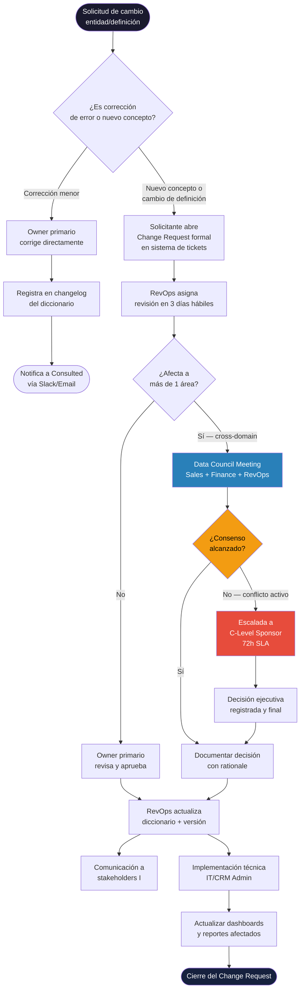

# KB_24 — Semantic Ownership \& Conflict Resolution: Diccionario de Entidades Corporativas

***

## Executive Summary

Este estándar define quién **posee**, **aprueba**, **cambia** y **resuelve conflictos** sobre las entidades del diccionario de datos compartido entre Sales, Finance y RevOps en organizaciones B2B con CRM como sistema de registro.

El problema central: los mismos términos (`Revenue`, `Opportunity`, `Customer`, `ARR`) tienen definiciones distintas según el área que los mide. Esto genera reportes contradictorios, pérdida de confianza en los datos y fricción operativa.[^1]

La solución no es tecnológica — es **semántica y política**. Requiere un proceso formal de ownership, un mecanismo de resolución de conflictos y un control de cambios que todos respeten.[^2]

RevOps actúa como árbitro neutral y custodio del diccionario. Finance es el área con mayor impacto en definiciones monetarias. Sales es productora primaria de datos de pipeline.[^3]

Sin este estándar, los equipos negocian definiciones en tiempo real durante las reuniones de cierre de mes — el peor momento para hacerlo.[^2]

Este documento cubre: RACI por entidad, workflow de change request, reglas de naming técnico→negocio, proceso de escalada y control de versiones del diccionario.

**Alcance:** CRM enterprise (Salesforce / HubSpot), ERP/Finance y herramientas de BI conectadas. Vigencia: 2025–2026.

***

## Definitions and Why It Matters

> `[FACT]` **Semantic ownership** es la asignación formal de responsabilidad sobre la definición, mantenimiento y control de cambios de una entidad de datos. No es lo mismo que ownership técnico (quién crea el campo) ni que ownership operativo (quién lo llena).[^4]

> `[FACT]` Un **diccionario de entidades** es el repositorio centralizado donde cada término del negocio tiene una definición canónica, owner, última fecha de revisión y contexto de uso válido.[^4]

> `[INFERENCE]` En mayoristas B2B de turismo como Alana Tours, las entidades críticas incluyen: `Agencia`, `Reserva`, `Oportunidad`, `Ingreso Confirmado`, `Margen Neto`, `Pasajero` — términos que Sales, Finance y Operaciones interpretan diferente.

**Por qué importa:** Las organizaciones que no gobiernan semánticamente sus entidades reportan datos inconsistentes entre CRM y ERP, lo que genera pérdida de confianza, decisiones lentas y conflictos de compensación.  La automatización de RevOps requiere definiciones estables: si `Closed Won` significa cosas distintas para Sales y Finance, ningún modelo de forecasting es confiable.[^5][^1]

***

## Principles and Best Practices

### Principio 1: Una entidad = un owner primario

> `[FACT]` Cada elemento de datos debe tener un owner designado — típicamente un data steward, analista de negocio o líder técnico — responsable de completitud, precisión y documentación de cambios.  *(getcollate.io, dic 2024)*[^4]

> `[FACT]` RevOps debe poseer las entidades de pipeline y métricas GTM; Finance debe poseer las entidades de revenue recognition y billing; Sales Ops posee deal stages, account hierarchy y campos de oportunidad.  *(thinkrevops.com, may 2025)*[^3]

**Regla:** Si una entidad cruza dominios, el owner primario es el área donde el dato **nace** (no donde se consume).

***

### Principio 2: Separar definición de implementación

> `[FACT]` Los datos se nombran frecuentemente antes de definirse, lo que genera conflictos estructurales. La resolución debe atacar el concepto de negocio primero, antes de resolver a nivel de campo o elemento técnico.  *(First San Francisco Partners, 2020)*[^2]

> `[INFERENCE]` En CRM enterprise, el campo `Amount` en Salesforce puede representar `Precio de lista`, `Precio negociado`, `Ingreso neto` o `Margen` según quién lo consulte. Sin una definición canónica acordada, los dashboards de Sales y Finance nunca coinciden.

***

### Principio 3: RevOps como árbitro, no dictador

> `[FACT]` Un RevOps Data Council con representantes de Sales Ops, Marketing Ops, CS Ops, Finance e IT define reglas, resuelve conflictos y mantiene la gobernanza activa.  *(thinkrevops.com, may 2025)*[^3]

> `[FACT]` Finance y RevOps tienen una relación estrecha: Finance depende de RevOps para datos de bookings, ARR y exactitud de comisiones; RevOps depende de Finance para reglas de reconocimiento de ingresos.  *(revengine.substack.com, nov 2025)*[^5]

***

### Principio 4: Gobernanza federada, no centralizada

> `[FACT]` Un enfoque de data strategy orientado a dominio enfatiza **federated governance** con ownership descentralizado por área de negocio.  *(enterprise-knowledge.com, ene 2026)*[^6]

> `[FACT]` Los estándares de metadata compartidos, con tags y clasificaciones comunes automatizados, reducen la fricción al integrar sistemas y escalar esfuerzos de gobernanza.  *(Atlan, oct 2025)*[^7]

***

## RACI Sugerido por Entidad

| Entidad | Sales | Finance | RevOps | IT/Data | Ejecutivo |
| :-- | :-- | :-- | :-- | :-- | :-- |
| `Opportunity` / `Deal` | **R/A** | C | C | I | I |
| `Closed Won` (definición) | C | C | **R/A** | I | I |
| `Revenue` (booking) | C | **R/A** | C | I | I |
| `ARR / MRR` | I | **R/A** | C | I | C |
| `Customer` / `Account` | C | I | **R/A** | C | I |
| `Pipeline Stage` | **R** | I | **A** | C | I |
| `Discount / Margin` | C | **R/A** | C | I | I |
| `Lead / Contact` | **R/A** | I | C | C | I |
| Entidades de pagos/billing | I | **R/A** | C | C | I |

**R** = Responsible (hace el trabajo) · **A** = Accountable (decide/aprueba) · **C** = Consulted · **I** = Informed[^3]

> `[INFERENCE]` En contextos LATAM con fricción financiera (Venezuela/Colombia), `Margen Neto` y `Tipo de Cambio Aplicado` deben tener ownership explícito en Finance con consulta obligatoria a RevOps — son campos con impacto directo en liquidación de comisiones.

***

## Workflow de Cambios (Change Request Process)

> `[FACT]` El proceso de resolución formal incluye 4 fases: reunir stakeholders, analizar el conflicto, formular opciones de resolución, y aprobar/implementar con registro en el glosario.  *(First San Francisco Partners, 2020)*[^2]

> `[FACT]` La resolución debe atacarse en la fuente siempre que sea posible, actualizando labels de pantalla y procesos de negocio origen.[^2]

***

## Reglas de Naming y Traducción Técnico → Negocio

### Convenciones de Nomenclatura

| Regla | Descripción | Ejemplo |
| :-- | :-- | :-- |
| **snake_case** para campos técnicos | Obligatorio en CRM/ERP | `net_margin_usd` |
| **Title Case** para etiquetas de negocio | Visible en UI y reportes | `Margen Neto (USD)` |
| **Prefijo de dominio** | Clarifica ownership | `fin_arr_monthly`, `sales_deal_stage` |
| **Sufijo de unidad** | Evita ambigüedad | `_usd`, `_pct`, `_count`, `_date` |
| **Sin abreviaciones no documentadas** | Todo acrónimo debe estar en el glosario | `arr` → `ARR (Annual Recurring Revenue)` |

> `[FACT]` Los nombres de datos se establecen frecuentemente antes de definirse, lo cual crea problemas estructurales; los procedimientos de resolución de nombres conflictivos deben estar incluidos en los estándares de naming.  *(GovInfo, naming conventions guide)*[^8]

### Tabla de Traducción Técnico → Negocio (ejemplos críticos)

| Campo Técnico (CRM) | Etiqueta de Negocio | Owner | Definición Canónica |
| :-- | :-- | :-- | :-- |
| `amount` | Valor de Oportunidad | Sales/A | Precio total ofertado, sin descuento |
| `net_amount` | Ingreso Neto Esperado | Finance/A | `amount` menos descuentos aprobados |
| `close_date` | Fecha Estimada de Cierre | Sales/R | Fecha proyectada por el ejecutivo |
| `committed_close_date` | Fecha Comprometida | RevOps/A | Fecha validada en forecast review |
| `stage` | Etapa del Pipeline | RevOps/A | Definición canónica con criterios de entrada/salida |
| `probability` | Probabilidad de Cierre | RevOps/A | Calculada por reglas, no manual |
| `account_type` | Tipo de Agencia | RevOps/A | Clasificación oficial: Minorista/Mayorista/OTA |
| `arr` | Ingreso Anual Recurrente | Finance/A | Revenue reconocido × 12, excluye one-time |

> `[INFERENCE]` En el contexto de Alana Tours, `Reserva Confirmada` ≠ `Ingreso Reconocido` ≠ `Pago Recibido`. Estas tres entidades deben tener definiciones separadas con owners explícitos para evitar confusión en reportes de cierre.

***

## Examples: Aplicado a CRM Enterprise

**Caso 1 — Conflicto Sales vs Finance sobre `Revenue`**

Sales reporta \$500K cerrado en Q4. Finance reporta \$380K. El conflicto surge porque Sales incluye deals en `Closed Won` con factura pendiente; Finance solo cuenta revenue reconocido según norma contable.[^5]

**Resolución:** RevOps media y define dos entidades separadas: `Bookings` (Sales, fecha de firma) y `Recognized Revenue` (Finance, fecha de reconocimiento). Ambas existen en el CRM con owners distintos y no se mezclan en dashboards.[^1]

**Caso 2 — Naming conflict en `Customer`**

Sales define `Customer` como cualquier cuenta con deal `Closed Won`. CS define `Customer` como cuenta con onboarding completado. Finance define `Customer` como cuenta con primer pago recibido.

**Resolución vía Data Council:** Se crea una entidad canónica `Account.lifecycle_stage` con valores: `prospect → won → active_customer → churned`, con criterios de transición definidos por cada área owner.[^3]

***

## Metrics / Success Signals

| Métrica | Target | Frecuencia |
| :-- | :-- | :-- |
| % entidades con owner asignado | 100% | Mensual |
| Tiempo promedio de resolución de conflictos | < 5 días hábiles | Por evento |
| % Change Requests resueltas sin escalada ejecutiva | > 80% | Trimestral |
| Versiones del diccionario publicadas | ≥ 1 por trimestre | Trimestral |
| Discrepancia Sales vs Finance en revenue report | < 2% | Mensual |
| NPS interno del diccionario (equipos usurios) | > 7/10 | Semestral |

> `[FACT]` La automatización de gobernanza de datos puede liberar hasta el 40% del tiempo del equipo cuando se implementa con metadata management activo.  *(Atlan, oct 2025)*[^7]

***

## Operational Checklist

**Setup inicial:**

- [ ] Inventariar todas las entidades en uso en CRM, ERP y BI
- [ ] Asignar owner primario a cada entidad (RACI completo)
- [ ] Documentar definición actual por área para identificar conflictos latentes
- [ ] Constituir el Data Council (Sales + Finance + RevOps + IT)
- [ ] Crear repositorio del diccionario (Notion, Confluence o herramienta de data catalog)[^9]

**Change Management:**

- [ ] Definir template de Change Request (campo, cambio propuesto, impacto, área solicitante)
- [ ] Establecer SLA por tipo de cambio (3 días corrección, 10 días cambio conceptual, 72h escalada)
- [ ] Implementar changelog versionado (semantic versioning: `v1.2.0`)
- [ ] Notificación automática a stakeholders `Informed` en cada cambio aprobado

**Mantenimiento continuo:**

- [ ] Revisión trimestral del diccionario con todos los owners
- [ ] Auditoría semestral de campos en CRM vs definición canónica
- [ ] Onboarding de nuevos miembros del equipo incluye lectura del diccionario
- [ ] Integrar diccionario como referencia en todos los dashboards de BI

***

## Anti-Patterns

> `[FACT]` Permitir que cualquier área haga un "end-run" alrededor del foro de resolución — es decir, implementar cambios sin pasar por el proceso — destruye la credibilidad del sistema de gobernanza.[^2]

- **Ownership por defecto de IT:** IT es responsable técnico de los campos, no de las definiciones de negocio. Confundirlos crea campos técnicamente correctos pero semánticamente vacíos.
- **Definir en reuniones de cierre de mes:** El peor momento para negociar definiciones es bajo presión de reporte.[^2]
- **Un diccionario por área:** Si Sales, Finance y RevOps mantienen sus propios glosarios sin integración, el conflicto semántico es inevitable.[^4]
- **Cambios sin comunicación a `Informed`:** Los dashboards se desactualizan silenciosamente. Genera desconfianza en los datos.
- **Ownership sin accountable claro:** `Responsible` sin `Accountable` = nadie decide cuando hay conflicto.[^3]
- **Nombres técnicos expuestos a usuarios de negocio:** `opp_amt_net_usd_q4_adj` en un dashboard de ventas es una garantía de mal uso del dato.[^8]

***

## Diagnostic Questions

1. ¿Hay entidades en el CRM que Sales y Finance definen diferente sin que nadie lo haya resuelto formalmente?
2. ¿Cuándo fue la última vez que el diccionario de entidades fue revisado y actualizado?
3. ¿Quién tiene la autoridad final para resolver un conflicto de definición entre Sales y Finance? ¿Está documentado?
4. ¿Los campos técnicos del CRM tienen etiquetas de negocio legibles y consistentes con el diccionario?
5. ¿Existe un proceso formal para proponer cambios a una definición, o se hace ad-hoc?
6. ¿Los nuevos miembros del equipo reciben onboarding sobre las definiciones canónicas?
7. ¿Cuántas discrepancias de reporte entre áreas se atribuyen a definiciones distintas del mismo término?
8. ¿RevOps tiene un rol explícito como árbitro en conflictos semánticos, o es informal?

***

## Key Takeaways for PM Practice

- **El conflicto semántico es político, no técnico.** La solución requiere proceso y autoridad, no mejor software.[^2]
- **RevOps como árbitro neutral** es el modelo más efectivo para organizaciones GTM maduras.[^3]
- **RACI sin `Accountable` = caos.** Cada entidad necesita un área que decida, no solo que "sepa".[^3]
- **Separar `Bookings` de `Revenue` reconocido** es la separación más crítica entre Sales y Finance en cualquier organización B2B.[^5]
- **El diccionario debe estar vivo:** sin revisiones trimestrales, se convierte en un documento de museo.[^4]
- **Naming técnico ≠ naming de negocio.** Los dashboards deben mostrar términos de negocio; los campos técnicos son infraestructura invisible.[^8]
- **El proceso de change request debe tener SLAs** — sin ellos, las solicitudes mueren y los equipos vuelven a operar en silos.[^2]
- **Para contextos LATAM con alta fricción financiera**, las entidades de tipo de cambio, margen neto y revenue neto requieren doble validación Sales + Finance antes de cualquier cambio. `[INFERENCE]`

***

## Sources

| ID | Fuente | Fecha | URL |
| :-- | :-- | :-- | :-- |
| S1 | Collate — Data Dictionary Best Practices 2025 | Dic 2024 | getcollate.io/learning-center/data-dictionary |
| S2 | First San Francisco Partners — Resolving Data Definition Conflicts | May 2020 | firstsanfranciscopartners.com |
| S3 | ThinkRevOps — Data Governance in RevOps | May 2025 | thinkrevops.com |
| S4 | Enterprise Knowledge — Data Management Trends 2025 | Ene 2026 | enterprise-knowledge.com |
| S5 | Varicent — RevOps Data Automation | Dic 2025 | varicent.com |
| S6 | Atlan — Data Governance Examples 2025 | Oct 2025 | atlan.com |
| S7 | Jeff Ignacio / RevEngine — Designing a RevOps Org | Nov 2025 | revengine.substack.com |
| S8 | GovInfo — Guide on Data Entity Naming Conventions | N/D | govinfo.gov |
| S9 | OvalEdge — Data Dictionary Tools | Nov 2025 | ovaledge.com |
| S10 | RevOps.io — Data Governance Framework | Mar 2022 | revops.io |

[^10][^11][^12][^13][^14][^15][^16]

⁂

[^1]: https://www.varicent.com/blog/revops-data-automation

[^2]: https://www.firstsanfranciscopartners.com/wp-content/uploads/2020/05/Resolving-Data-Definition-Conflicts-FSFP-May-13-2020.pdf

[^3]: https://www.thinkrevops.com/post/why-data-governance-is-a-critical-pillar-of-revenue-operations

[^4]: https://www.getcollate.io/learning-center/data-dictionary

[^5]: https://revengine.substack.com/p/designing-a-revops-org

[^6]: https://enterprise-knowledge.com/data-management-and-architecture-trends-for-2025/

[^7]: https://atlan.com/data-governance-examples/

[^8]: https://www.govinfo.gov/content/pkg/GOVPUB-C13-94ab71a32c5fe6f2c61a6c3ba14c307a/pdf/GOVPUB-C13-94ab71a32c5fe6f2c61a6c3ba14c307a.pdf

[^9]: https://www.ovaledge.com/blog/data-dictionary-tools/

[^10]: pasted-text.txt

[^11]: https://murdio.com/insights/data-catalog-tools/

[^12]: https://www.linkedin.com/pulse/enterprise-data-dictionary-from-optional-governance-output-allen-niu-vt5uc

[^13]: https://www.secoda.co/blog/top-data-dictionary-tools

[^14]: https://www.revops.io/blog/compliance-and-sales-ops-a-data-governance-framework

[^15]: https://learn.microsoft.com/en-us/azure/cloud-adoption-framework/ready/azure-best-practices/resource-naming

[^16]: https://www.ewsolutions.com/ai-and-data-governance/

